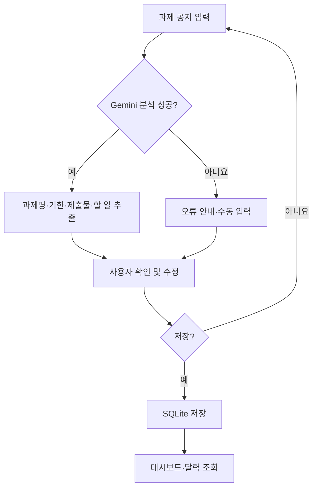

# 서비스 흐름도 (예정 기능 포함)

```mermaid
flowchart TD
 A[과제 공지 입력] --> B{Gemini 분석 성공?}
 B -- 아니요 --> C[오류 안내·수동 입력]
 B -- 예 --> D[과제명·기한·제출물·할 일 추출]
 D --> E[사용자 확인 및 수정]
 C --> E
 E --> F{저장?}
 F -- 예 --> G[SQLite 저장]
 F -- 아니요 --> A
 G --> H[대시보드·달력 조회]
```
